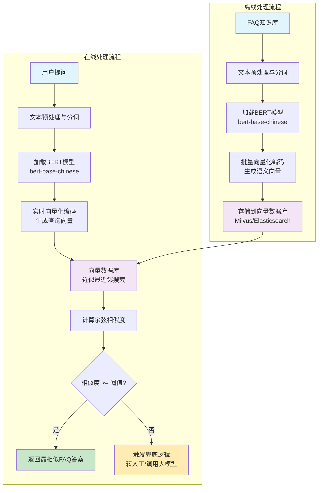

### **基于BERT的FAQ语义匹配技术方案**

## 一、技术方案概述

本方案旨在构建一个基于BERT（Bidirectional Encoder Representations from Transformers）的智能问答系统，核心功能是将用户的实时提问与预先构建的FAQ知识库进行**语义相似度匹配**，并返回最相似问题的标准答案。方案分为两大核心模块：**文本编码模块**和**相似度计算与匹配模块**。整体技术流程遵循从数据准备到在线服务的完整链路。

## 二、文本编码模块：将FAQ与用户提问转化为语义向量

此模块负责将非结构化的文本数据转化为机器可理解的、富含语义信息的向量表示，是后续相似度计算的基础。

1. **环境与模型准备**：首先，需要搭建Python环境，并安装核心依赖库，包括`transformers`（用于加载和使用BERT模型）和`torch`（PyTorch深度学习框架）。考虑到我们的应用场景是中文客服，应选择针对中文优化的预训练模型，例如`bert-base-chinese`。

2. **文本预处理与分词**：输入文本（包括FAQ库中的标准问法、相似问法以及用户实时提问）需要进行预处理，如去除无关特殊字符、统一大小写等。随后，使用与所选BERT模型配套的分词器（Tokenizer）进行处理。分词器会将句子分割成子词（Token），并自动添加特殊的`[CLS]`（用于分类）和`[SEP]`（用于分隔句子）标记，同时生成模型所需的注意力掩码（Attention Mask）。

3. **向量化（编码）**：将预处理后的Token序列输入到BERT模型中。BERT通过其多层的Transformer编码器，为每个输入Token生成一个上下文相关的嵌入向量（Embedding）
   
   。对于句子级别的语义表示，通常有两种主流方法：
   
   - **使用[CLS]标记向量**：取BERT最后一层隐藏状态中对应`[CLS]`标记的向量作为整个句子的语义表示。这在BERT原始的句子对分类任务中被证明是有效的。
   
   - **对全部Token向量进行池化（Pooling）**：更常用的方法是取最后一层所有Token向量的平均值（Mean Pooling）或最大值（Max Pooling）作为句子向量。这种方法能更均衡地利用整个句子的信息，实践表明其效果通常优于直接使用`[CLS]`向量。  

## 三、相似度计算与匹配模块：从向量到答案的检索

此模块负责计算用户提问向量与FAQ库中所有问题向量之间的相似度，并找出最佳匹配。

1. **离线FAQ库向量化**：为提高在线查询效率，需在系统上线前进行**离线预处理**。将FAQ知识库中的所有标准问题及其相似问法，通过上述文本编码模块批量转化为语义向量，并存储于高效的向量数据库（如Milvus、Elasticsearch with vectors）或高性能缓存中。这避免了每次用户提问时都对整个知识库进行实时编码的巨大开销。

2. **在线相似度计算**：当用户提问时，系统实时将该问题编码为语义向量。随后，在向量数据库中进行**近似最近邻搜索**，计算该向量与FAQ库中所有预存向量之间的**余弦相似度**。余弦相似度通过衡量两个向量在方向上的差异来评估语义相似性，值越接近1表示越相似，越接近-1表示越相反，是文本相似度计算中最常用的度量方法。

3. **结果匹配与返回**：系统根据计算出的余弦相似度分数进行排序，返回分数最高（即最相似）的一个或若干个FAQ条目。可以设定一个相似度阈值（例如0.7），仅当最高分超过该阈值时才返回答案，否则可触发“未匹配到答案”的兜底逻辑，例如转交人工客服或调用大模型进行生成式回答。

## 四、系统流程图

**流程说明：**

- **离线处理流程**：系统上线前，将FAQ知识库中的所有问题预先向量化并存储，提高在线查询效率
- **在线处理流程**：用户提问时，实时编码问题向量，在向量数据库中搜索最相似的FAQ，根据相似度阈值返回答案或触发兜底机制
- **核心技术**：BERT文本编码 + 余弦相似度计算 + 向量数据库检索
